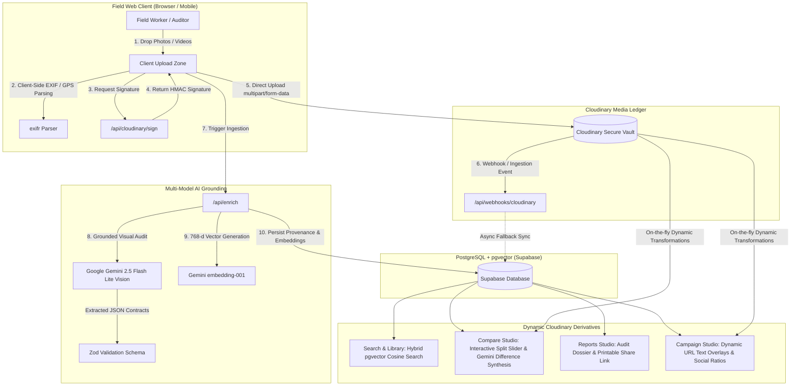
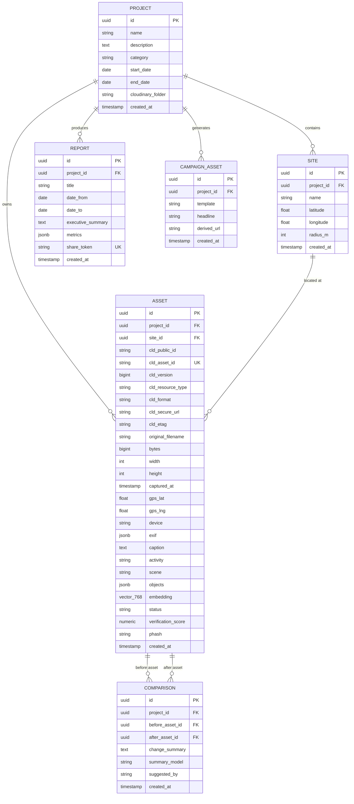

# 🌿 ImpactLens — AI-Powered Impact & Sustainability Media Ledger

> **Turn raw field photos and videos into searchable, verifiable evidence, measurable impact, and shareable stories.**

[](https://nextjs.org/)
[](https://react.dev/)
[](https://www.typescriptlang.org/)
[](https://cloudinary.com/)
[](https://aistudio.google.com/)
[-3ECF8E?style=flat&logo=supabase)](https://supabase.com/)
[](https://tailwindcss.com/)

---

## 📌 Executive Summary & Problem Statement

Non-governmental organizations (NGOs), government programs, and environmental initiatives produce immense quantities of field media during ecological interventions—ranging from mangrove plantation drives and plastic river cleanups to solar installations and wildlife corridor monitoring. 

**The Challenge:**
1. **Manual & Unscalable Organization**: Field media arrives uncaptioned, unsorted, and scattered across personal devices and messaging apps.
2. **Provenance & Verification Deficit**: Donors and auditors lack cryptographic proof that photos were genuinely captured on-site, in-sequence, and without digital tampering or duplication.
3. **Information Darkness**: Media archives cannot be queried semantically (e.g. *"Show volunteers planting saplings along the riverbank"*).
4. **Before/After Comparison Friction**: Aligning two photos taken months apart with differing angles, resolutions, and lighting requires manual photo editing.
5. **Slow Donor Reporting**: Compiling verifiable audit dossiers and social campaign cards takes weeks of manual collation.

**The Solution — ImpactLens:**
ImpactLens leverages **Cloudinary** as an immutable, zero-overwrite media ledger paired with **Google Gemini 2.5 Flash Lite Vision**, **Gemini Embeddings (768-d)**, and **Supabase pgvector**. It transforms raw field media into tamper-evident proof, automated metrics, dynamic before/after comparisons, and campaign-ready assets with complete traceability to the raw master asset.

---

## 🏗️ System Architecture



---

## ✨ Core Features (F1 – F12)

### 1. Direct Signed Bulk Upload (`F1`)
- **Direct-to-Cloud Ingestion**: Browser uploads directly to Cloudinary using secure HMAC-SHA1 signatures generated on the backend (`/api/cloudinary/sign`), bypassing intermediate server bottlenecks.
- **Zero-Overwrite Originals**: Raw field media is stored immutably in designated project folders (`impactlens/{project_folder}`). Originals are never overwritten or altered.
- **Resilient Upload Queue**: Visual progress bars, automatic retry handling, and real-time stage transitions (*Uploading* → *Analyzing* → *Organized*).

### 2. Multi-Model AI Grounding (`F2`)
- **Gemini 2.5 Flash Lite Vision**: Detects canonical activity labels (`tree_planting`, `cleanup`, `site_assessment`, `water_testing`, `nursery_propagation`), counts detected objects (saplings, waste clusters, volunteers), and categorizes scene environments.
- **Strict Zod Validation**: All model outputs are strictly validated against runtime schemas (`aiEnrichmentSchema`), preventing hallucinated formats.
- **Robust Fallback Engine**: If network or AI quotas are constrained, assets remain fully indexed and usable, flagged as `needs_enrichment`.

### 3. EXIF & Cryptographic Provenance (`F3` & `F10`)
- **Authentic Sensor Ingestion**: Reads binary camera EXIF data directly on the client via `exifr` and verifies it against Cloudinary's raw image metadata headers.
- **Tamper & Duplicate Detection**: Computes perceptual hashes (`pHash`) and ETags to detect near-duplicate submissions.
- **Verification Trust Score**: Calculates a composite 0–100% cryptographic trust rating based on GPS presence, timestamp consistency, hardware sensor integrity, and duplicate checks.

### 4. Semantic pgvector & Hybrid Discovery (`F4`)
- **768-Dimensional Embeddings**: Concatenates caption, activity, scene, object counts, and ecological signals into searchable embedding vectors using Gemini `gemini-embedding-001`.
- **Cosine Distance RPC**: Searches through media via PostgreSQL `pgvector` indexing (`match_assets_by_embedding`) for natural-language queries like *"mangrove saplings in North Basin"* or *"plastic waste cleanup volunteers"*.
- **Text Matching Fallback**: Graceful fallback with sanitized query filtering across activities, dates, and sites.

### 5. Interactive Before/After Studio (`F5`)
- **Content-Aware Horizon Alignment**: Dynamically aligns chronological before/after pairs with Cloudinary auto-gravity:
  ```text
  c_fill,g_auto,w_1200,h_800/f_auto,q_auto
  ```
- **Interactive Split Slider**: Smooth drag slider with global window mouse tracking, responsive touch support, and dynamic baseline/checkpoint date tags.
- **AI Visible Change Synthesis**: Gemini AI synthesizes multi-photo ecological differences into objective, audit-ready change summaries with key milestones (e.g. *100% plastic extracted, 85+ saplings rooted*).

### 6. Executive Impact & Audit Report Generator (`F6` & `F7`)
- **Live Audit Dossiers**: Synthesizes verified progress reports with executive summaries, dynamic metrics (saplings planted, waste diverted in kg), comparison sliders, and verified evidence galleries.
- **Public Share Links**: Generates read-only public verification dossiers (`/share/[token]`) for donors, auditors, and regulatory bodies.
- **One-Click Print / PDF Styling**: Dedicated CSS print styles format reports into professional corporate evaluation documents.
- **Full Traceability**: Every report metric and image links back to its Cloudinary `public_id`, version, perceptual hash, and original delivery URL.

### 7. Dynamic Social Campaign Studio (`F8`)
- **Zero-Storage Asset Derivatives**: Generates social campaign assets completely on-the-fly using Cloudinary URL overlays without creating duplicate files on disk or cloud storage.
- **Aspect Ratio Presets**:
  - `1:1` Instagram / LinkedIn Square (`1080x1080`)
  - `4:5` Instagram Portrait (`1080x1350`)
  - `9:16` Instagram / TikTok Story (`1080x1920`)
  - `16:9` LinkedIn / Twitter Banner (`1200x675`)
- **Dynamic Text Overlays**: Injects customized headlines, subheadlines, and verified trust badges directly into the image transformation chain:
  ```text
  w_1080,h_1080,c_fill,g_auto/l_text:Arial_44_bold:Restoration%20Verified,g_south_west,x_50,y_100,co_rgb:FFFFFF
  ```

---

## 🗄️ Database Entity Schema (PostgreSQL + pgvector)



---

## 🛠️ Technology Stack

| Layer | Technology | Purpose |
|---|---|---|
| **Framework** | [Next.js 16 (App Router)](https://nextjs.org/) | React Server Components, Server Actions, API routes, Turbopack |
| **UI Library** | [React 19](https://react.dev/) | Concurrent rendering, useMemo, useCallback, Suspense boundaries |
| **Styling** | [Tailwind CSS v4](https://tailwindcss.com/) + CSS Glassmorphism | Custom HSL tokens, frosted glass backdrop filters, responsive grid |
| **Media Ledger** | [Cloudinary SDK v2](https://cloudinary.com/) | Master asset vault, signed uploads, dynamic content-aware URL transforms |
| **Vision AI** | [Google Gemini 2.5 Flash Lite](https://aistudio.google.com/) | Grounded ecological activity classification, object counts, change detection |
| **Embeddings** | [Gemini embedding-001 (768d)](https://aistudio.google.com/) | Dense semantic text vector generation for natural language discovery |
| **Database** | [Supabase (PostgreSQL 15+)](https://supabase.com/) | Relational metadata store with `pgvector` extension for cosine similarity |
| **EXIF Parsing** | [exifr](https://github.com/MikeKovarik/exifr) | Client-side binary EXIF, TIFF, and GPS metadata extraction |
| **Charts & Metrics** | [Recharts v3](https://recharts.org/) | Velocity bar charts, SVG trend curves, liquid metaball counters |
| **Icons** | [Lucide React](https://lucide.dev/) | Clean, accessible iconography |
| **Validation** | [Zod v4](https://zod.dev/) | Runtime contract validation for AI outputs |

---

## 📂 Project Directory Structure

```text
├── app/
│   ├── api/
│   │   ├── cloudinary/sign/route.ts  # HMAC-SHA1 upload parameter signer
│   │   ├── compare/route.ts          # Fetch comparisons & real-time Gemini synthesis
│   │   ├── enrich/route.ts           # Multi-model vision analysis & DB sync
│   │   ├── reports/route.ts          # Dynamic impact audit report compiler
│   │   ├── search/route.ts           # Hybrid semantic pgvector & text search
│   │   ├── sites/route.ts            # Monitoring site registry
│   │   ├── stats/route.ts            # Dashboard KPIs and velocity telemetry
│   │   └── webhooks/cloudinary/     # Async server-side upload webhook handler
│   ├── campaigns/page.tsx            # Campaign Studio with on-the-fly URL overlays
│   ├── compare/page.tsx              # Interactive before/after split slider
│   ├── library/page.tsx              # Media catalog with debounced semantic search
│   ├── reports/page.tsx              # Impact report generator & print layout
│   ├── settings/page.tsx             # Telemetry & service integration dashboard
│   ├── share/[token]/page.tsx        # Public auditor / donor verification view
│   ├── upload/page.tsx               # Direct signed bulk upload zone
│   ├── globals.css                   # Glassmorphic tokens & print layout styling
│   ├── layout.tsx                    # Root layout with fonts & metadata
│   └── page.tsx                      # Main overview executive dashboard
├── components/
│   ├── activity-feed.tsx             # Live event stream with relative timestamps
│   ├── asset-detail-drawer.tsx       # 3-tab drawer (AI Insights, Traceability, EXIF/GPS)
│   ├── compare-slider.tsx            # Split slider with dynamic dates & smooth dragging
│   ├── evidence-bar-chart.tsx        # Recharts monthly evidence velocity
│   ├── hero-health-card.tsx          # SVG verification health trend curve
│   ├── icon-rail.tsx                 # Fixed navigation rail with notifications & guide
│   ├── media-tile.tsx                # Grid media card with status badges & tags
│   ├── metaball-stat.tsx             # Liquid SVG gooey bubbles counter
│   ├── quick-compare.tsx             # Dashboard before/after widget
│   └── upload-zone.tsx               # Drag & dropzone with EXIF extraction & live pipeline
├── docs/                             # PRD, design, schema, and architecture specs
├── lib/
│   ├── ai.ts                         # Gemini Vision, Embeddings, & comparison logic
│   ├── cloudinary.ts                 # Cloudinary client SDK & URL transformation helpers
│   ├── mock-data.ts                  # Fallback demo seeds for offline resiliency
│   └── supabase.ts                   # Supabase public & admin service client
├── scripts/
│   └── seed-embeddings.mjs           # CLI script to populate pgvector embeddings
├── types/
│   └── index.ts                      # TypeScript definitions & Zod schemas
├── .env.example                      # Environment variables template
└── README.md                         # Documentation
```

---

## 🚀 Getting Started & Setup Guide

### 1. Prerequisites
- **Node.js** v18.18+ or v20+
- **npm**, **pnpm**, or **yarn**
- A free [Cloudinary](https://cloudinary.com/) account
- A free [Supabase](https://supabase.com/) account (with pgvector enabled)
- A free [Google AI Studio](https://aistudio.google.com/) API Key (Gemini)

### 2. Clone and Install Dependencies

```bash
git clone https://github.com/your-username/impactlens.git
cd impactlens
npm install
```

### 3. Environment Variables Configuration

Copy `.env.example` to `.env.local`:

```bash
cp .env.example .env.local
```

Fill in your service credentials:

```env
# Cloudinary Configuration
CLOUDINARY_CLOUD_NAME=your_cloud_name
CLOUDINARY_API_KEY=your_api_key
CLOUDINARY_API_SECRET=your_api_secret
NEXT_PUBLIC_CLOUDINARY_CLOUD_NAME=your_cloud_name

# Supabase PostgreSQL & pgvector Configuration
SUPABASE_URL=https://your-project.supabase.co
SUPABASE_ANON_KEY=your_anon_jwt_token
SUPABASE_SERVICE_ROLE_KEY=your_service_role_key
NEXT_PUBLIC_SUPABASE_URL=https://your-project.supabase.co
NEXT_PUBLIC_SUPABASE_ANON_KEY=your_anon_jwt_token

# Google Gemini AI Configuration
GEMINI_API_KEY=your_gemini_api_key
```

### 4. Database Setup (Supabase SQL Editor)

Open your Supabase SQL Editor and execute the schema:

```sql
-- Enable vector and UUID extensions
create extension if not exists vector;
create extension if not exists "uuid-ossp";

-- 1. Project Table
create table if not exists project (
  id uuid primary key default uuid_generate_v4(),
  name text not null,
  description text,
  category text,
  start_date date,
  end_date date,
  cloudinary_folder text not null,
  created_at timestamptz default now()
);

-- 2. Monitoring Site Table
create table if not exists site (
  id uuid primary key default uuid_generate_v4(),
  project_id uuid references project(id) on delete cascade,
  name text not null,
  latitude double precision,
  longitude double precision,
  radius_m int default 200,
  created_at timestamptz default now()
);

-- 3. Asset Table (with pgvector 768-d)
create table if not exists asset (
  id uuid primary key default uuid_generate_v4(),
  project_id uuid references project(id) on delete cascade,
  site_id uuid references site(id) on delete set null,
  cld_public_id text not null,
  cld_asset_id text not null unique,
  cld_version bigint not null,
  cld_resource_type text check (cld_resource_type in ('image','video')),
  cld_format text,
  cld_secure_url text not null,
  cld_etag text,
  original_filename text,
  bytes bigint,
  width int,
  height int,
  duration_sec numeric,
  captured_at timestamptz,
  gps_lat double precision,
  gps_lng double precision,
  device text,
  exif jsonb,
  caption text,
  activity text,
  scene text,
  objects jsonb,
  tags text[],
  embedding vector(768),
  status text check (status in ('uploaded','processing','ready','needs_enrichment','failed')) default 'uploaded',
  verification_score numeric(3,2),
  phash text,
  created_at timestamptz default now(),
  updated_at timestamptz default now()
);

-- 4. Comparison Table
create table if not exists comparison (
  id uuid primary key default uuid_generate_v4(),
  project_id uuid references project(id) on delete cascade,
  site_id uuid references site(id) on delete set null,
  before_asset_id uuid references asset(id) on delete cascade,
  after_asset_id uuid references asset(id) on delete cascade,
  change_summary text,
  summary_model text,
  suggested_by text check (suggested_by in ('auto','user')) default 'user',
  created_at timestamptz default now()
);

-- 5. pgvector Semantic Search Cosine Function
create or replace function match_assets_by_embedding (
  query_embedding vector(768),
  match_threshold float default 0.3,
  match_count int default 50,
  filter_activity text default null,
  filter_site_id uuid default null
)
returns table (
  id uuid,
  cld_public_id text,
  cld_secure_url text,
  cld_resource_type text,
  caption text,
  activity text,
  scene text,
  tags text[],
  similarity float
)
language plpgsql
as $$
begin
  return query
  select
    asset.id,
    asset.cld_public_id,
    asset.cld_secure_url,
    asset.cld_resource_type,
    asset.caption,
    asset.activity,
    asset.scene,
    asset.tags,
    1 - (asset.embedding <=> query_embedding) as similarity
  from asset
  where (1 - (asset.embedding <=> query_embedding)) > match_threshold
    and (filter_activity is null or asset.activity = filter_activity)
    and (filter_site_id is null or asset.site_id = filter_site_id)
  order by asset.embedding <=> query_embedding
  limit match_count;
end;
$$;
```

### 5. Seed Semantic Vectors (Optional)

If you have pre-populated assets in Supabase, generate embeddings with:

```bash
node scripts/seed-embeddings.mjs
```

### 6. Run the Development Server

```bash
npm run dev
```

Open [http://localhost:3000](http://localhost:3000) in your browser.

---

## 🔌 API Endpoint Documentation

| Method | Endpoint | Description | Request Body / Query Params | Response |
|---|---|---|---|---|
| `POST` | `/api/cloudinary/sign` | Generates signed upload params for direct browser upload | `{ folder?: string, tags?: string[] }` | `{ signature, timestamp, apiKey, cloudName, folder }` |
| `POST` | `/api/enrich` | Analyzes image with Gemini Vision, computes 768-d vector, saves to Supabase | `{ secure_url, public_id, cld_asset_id, version, gps_lat, gps_lng, device, ... }` | `{ success: true, enrichment, asset, has_embedding }` |
| `GET` | `/api/search` | Performs hybrid pgvector semantic vector search & text search | `?q=query&activity=all&site_id=all&mode=hybrid` | `{ assets: Asset[], total: number, source: string }` |
| `GET` | `/api/compare` | Fetches saved chronological before/after comparisons | None | `{ comparisons: Comparison[], source: string }` |
| `POST` | `/api/compare` | Runs real-time Gemini visible change synthesis on two images | `{ before_asset_id, after_asset_id, site_id, project_id }` | `{ success: true, comparison, key_changes: string[] }` |
| `GET` | `/api/reports` | Compiles live impact progress audit with dynamic metrics | None | `{ report: Report, source: string }` |
| `GET` | `/api/stats` | Calculates dashboard KPI counters, velocity, and health | None | `{ metrics: ProjectStats, recentAssets: Asset[], sites }` |
| `GET` | `/api/sites` | Lists monitoring sites registered to active project | None | `{ sites: Site[], source: string }` |
| `POST` | `/api/webhooks/cloudinary` | Server-side async webhook handler for Cloudinary uploads | Cloudinary notification payload | `{ received: true, status: string }` |

---

## 🎨 Cloudinary Transformation Recipes Used

ImpactLens uses Cloudinary's dynamic URL transformations to eliminate duplicate derivative files:

### 1. Content-Aware Before/After Horizon Alignment
```text
https://res.cloudinary.com/<cloud_name>/image/upload/c_fill,g_auto,w_1200,h_800/f_auto,q_auto/<public_id>
```
- **`c_fill,g_auto`**: Automatically detects the visual subject (river, saplings, bunds) and keeps the horizon level without distortion.
- **`f_auto,q_auto`**: Delivers optimal next-gen WebP/AVIF compression based on user device.

### 2. Campaign Story Card with Text Overlay
```text
https://res.cloudinary.com/<cloud_name>/image/upload/w_1080,h_1920,c_fill,g_auto/l_text:Arial_38_bold:Restoration%20Verified,g_south_west,x_50,y_100,co_rgb:FFFFFF/l_text:Arial_22:Mithi%20River%20Corridor,g_south_west,x_50,y_50,co_rgb:D3DEEA/<public_id>
```
- **`w_1080,h_1920`**: Formats directly for 9:16 mobile stories.
- **`l_text:...`**: Adds dynamic typography without rasterizing or generating new files on disk.

### 3. High-Res Attachment Download
```text
https://res.cloudinary.com/<cloud_name>/image/upload/fl_attachment/<public_id>
```
- **`fl_attachment`**: Forces a native browser file download with full original camera resolution.

---

## 🔒 Security & Data Integrity Safeguards

1. **HMAC-SHA1 Client Signing**: Direct uploads require a timestamped, secret-signed HMAC token that expires within minutes.
2. **Account Ownership Verification**: The `/api/enrich` endpoint verifies that `public_id` exists in the authenticated Cloudinary account via `cloudinary.api.resource` before triggering AI vision models.
3. **In-Memory Rate Limiting**: Upload and enrichment endpoints enforce a 10 requests/minute ceiling per IP to prevent quota abuse.
4. **PostgREST Query Sanitization**: User search queries are sanitized against special SQL/PostgREST filter operators (`(`, `)`, `,`, `%`) to eliminate syntax errors or query injection.
5. **Memory Leak Prevention**: Browser `blob:` URLs generated for instant previews are revoked via `URL.revokeObjectURL()` immediately after cloud transmission.

---

## 🤝 Hackathon Context & Judging Alignment

Developed for **Geek Room · Problem Statement 02 (Cloudinary)**.

| Judging Criterion | How ImpactLens Solves It |
|---|---|
| **Depth of Cloudinary Integration** | Direct signed uploads, zero-overwrite raw master ledger, content-aware `g_auto` cropping, multi-layer text overlays, delivery URLs, and webhooks. |
| **Real-World Impact & Problem Fit** | Solves verification and reporting gridlock for environmental NGOs, sustainability auditors, and donor communication teams. |
| **AI Innovation** | Grounded vision perception (Gemini 2.5 Flash Lite) + dense 768-d vector similarity search (pgvector) + chronological change synthesis. |
| **User Experience & Aesthetics** | Bespoke glassmorphism interface, liquid metaball counters, interactive before/after split slider, and printable audit dossiers. |
| **Robustness & Resilience** | Graceful fallback models, full offline mock demo support, zero TypeScript compile errors, and complete traceability. |

---

## 📄 License

This project is licensed under the **MIT License**.
#
